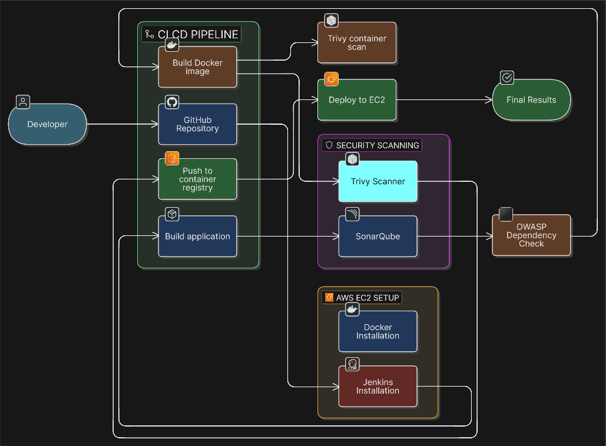
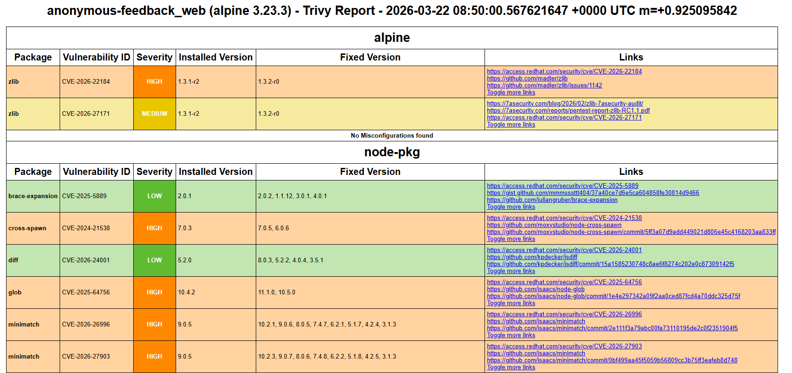
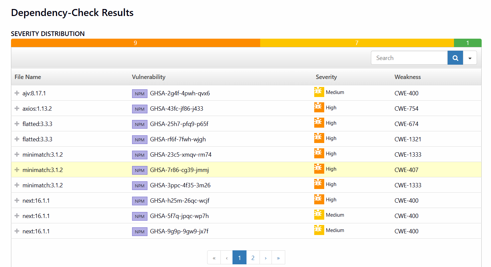
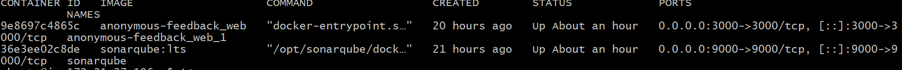
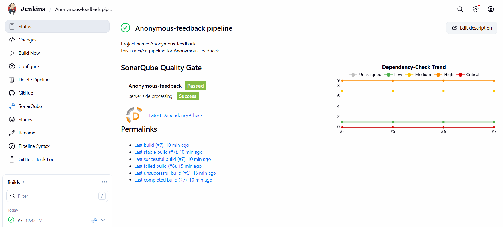
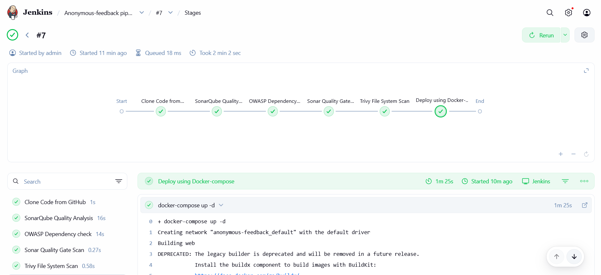

---

DEVSECOPS 3-TIER  PIPELINE (AWS + JENKINS)

---

## AWS EC2 SETUP

Launch EC2:

- Ubuntu 22.04
- minimum 4GB memory machine
- 12GB storage

Security Group Inbound Rules:

- 22 → SSH
- 8080 → Jenkins
- 9000 → SonarQube
- 80 → Application
- 443 → HTTPS (optional)

---

## SYSTEM SETUP

```bash
sudo apt update && sudo apt upgrade -y
```

---

## 🐳 DOCKER INSTALLATION

```bash
sudo apt install -y docker.io
sudo apt install -y docker-compose
```

```bash
sudo systemctl start docker
sudo systemctl enable docker
sudo usermod -aG docker $USER
```

```bash
sudo reboot
```

Verify:

```bash
docker --version
```

---

## JENKINS INSTALLATION

Update the Debian apt repositories, install OpenJDK 21, and check the installation using the following commands:

```bash
sudo apt update
sudo apt install fontconfig openjdk-21-jre
java -version
```

```bash
sudo wget -O /etc/apt/keyrings/jenkins-keyring.asc \
  https://pkg.jenkins.io/debian-stable/jenkins.io-2026.key
echo "deb [signed-by=/etc/apt/keyrings/jenkins-keyring.asc]" \
  https://pkg.jenkins.io/debian-stable binary/ | sudo tee \
  /etc/apt/sources.list.d/jenkins.list > /dev/null
sudo apt update
sudo apt install jenkins
```

```bash
sudo systemctl start jenkins
sudo systemctl enable jenkins
```

Check:

```bash
sudo systemctl status jenkins
```

---

## ACCESS JENKINS

security->Edit inbound port to 8080

http://EC2-IP:8080

Get password:
sudo cat /var/lib/jenkins/secrets/initialAdminPassword

- Install suggested plugins
- Create admin user

---


## SONARQUBE SETUP (DOCKER)

- Architecture Overview

Developer → GitHub → Jenkins (EC2-1) → SonarQube (EC2-2) → Quality Gate

- Docker setup

```bash
sudo apt update && sudo apt upgrade -y
sudo systemctl start docker
sudo systemctl enable docker
```
- Configure Kernel Parameters

```bash
sudo sysctl -w vm.max_map_count=262144
sudo sysctl -w fs.file-max=65536
```

- Make these changes permanent
```bash
echo "vm.max_map_count=262144" | sudo tee -a /etc/sysctl.conf
echo "fs.file-max=65536" | sudo tee -a /etc/sysctl.conf
```

- Apply the configuration:

```bash
sudo sysctl -p
```
- Pull SonarQube Docker Image 

```bash
docker pull sonarqube:lts
```

- Run SonarQube Container
```bash
docker run -d \
 --name sonarqube \
 -p 9000:9000 \
 --restart always \
 sonarqube:lts
```

- Check container status:
```bash
docker ps
```

- Open Required Port
```bash
sudo ufw allow 9000
sudo ufw reload
```


## TRIVY INSTALLATION

```bash
sudo apt-get install wget gnupg
wget -qO - https://aquasecurity.github.io/trivy-repo/deb/public.key | gpg --dearmor | sudo tee /usr/share/keyrings/trivy.gpg > /dev/null
echo "deb [signed-by=/usr/share/keyrings/trivy.gpg] https://aquasecurity.github.io/trivy-repo/deb generic main" | sudo tee -a /etc/apt/sources.list.d/trivy.list
sudo apt-get update
sudo apt-get install trivy
```

# Results of Trivy


---


## OWASP DEPENDENCY CHECK

Manage Jenkins → Plugins → Install:

- SonarQube Scanner
- Sonar Quality Gates
- OWASP Dependency-Check
- Docker

Restart Jenkins after install.

# Dependency result


---

# jenkins-SonarQube integration

- step 1

Add this in SonarQube

Configure:

Adminstration → Configuration → webhook → create

url : http://EC2_PUBLIC_KEY:8080/sonarqube-webhook/

Generate Tokens

Security → Tokens → create token 

- step 2

Add this in jenkins

- subpart 1

Manage jenkins → system → SonarQube Server → name like Sonar (Later used in pipeline)

server Authentication Token → paste the token from sonarqube

- subpart 2

Manage jenkins → Tools → SonarQube Scanner installation -> save

- Dependency-Check installation

Manage jenkins → Tools → Add Dependency Check -> install automatically → install via github.com


## docker ps



## JENKINS PIPELINE

New Item → Pipeline → Paste below:

follow → GitHub project → paste Github URL → Throttle builds → build triggers for automatic SCM polling

```bash
pipeline{
    agent any
    environment{
        SONAR_HOME=tool "Sonar"
    }
    stages{
        stage("Clone Code from GitHub"){
            steps{
               git url: "https://github.com/username/repo.git", branch: "main"
            }
        }
        stage("SonarQube Quality Analysis"){
            steps{
                withSonarQubeEnv("Sonar"){
                    sh "$SONAR_HOME/bin/sonar-scanner -Dsonar.projectName=REPOSITORY-NAME -Dsonar.projectKey=REPOSITORY-NAME"
                }
            }
        }
        stage("OWASP Dependency check"){
            steps{
                dependencyCheck additionalArguments: '--scan ./', odcInstallation: 'Dependecy-check'
                dependencyCheckPublisher pattern: '**/dependency-check-report.xml'
            }
        }
        stage("Sonar Quality Gate Scan"){
            steps{
                timeout(time: 2, unit: "MINUTES"){
                    waitForQualityGate abortPipeline: false
                }
            }
        }
        stage("Trivy File System Scan"){
            steps{
                sh "trivy fs --format table -o trivy-fs-report.html ."
            }
        }
        stage("Deploy using Docker-compose"){
            steps{
                sh "docker-compose up -d"
            }
        }
    }
}
```


